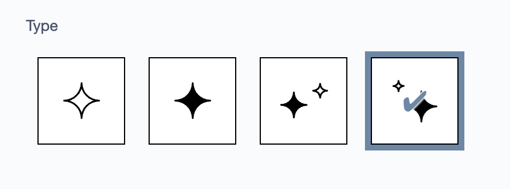
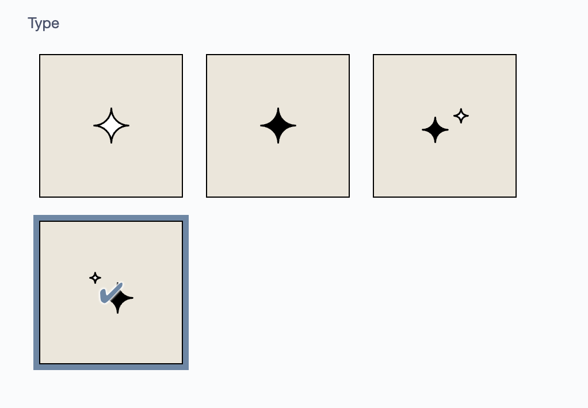

# Silverstripe Visual Fields
[](https://packagist.org/packages/iliain/silverstripe-visualfields) 
[](https://packagist.org/packages/iliain/silverstripe-visualfields) 
[](https://packagist.org/packages/iliain/silverstripe-visualfields) 
[](https://packagist.org/packages/iliain/silverstripe-visualfields) 
[](https://packagist.org/packages/iliain/silverstripe-visualfields)

Provides similar functionality to [heyday/silverstripe-colorpalette](https://github.com/WPP-Public/silverstripe-colorpalette), but uses images rather than colours.

## Installation (with composer)

	$ composer require iliain/silverstripe-visualfields

## Usage

```php
$fields->addFieldToTab('Root.Main', $layoutField = VisualOptionField::create('BlockLayout', 'Layout', [
    'layout-1' => $layoutFolderPath . '/layout-1.png',
    'layout-2' => $layoutFolderPath . '/layout-2.png'
]));
```

[](docs/images/visualfields.png)

## Customising

You can customise the size and background colour of the images with the following options:

```php
$layoutField->setOptionWidth('250px');
$layoutField->setOptionHeight('150px');
$layoutField->setOptionBackgroundColour('#f0f0f0'); // Only visible if the image has transparency
```

[](docs/images/visualfields.png)
