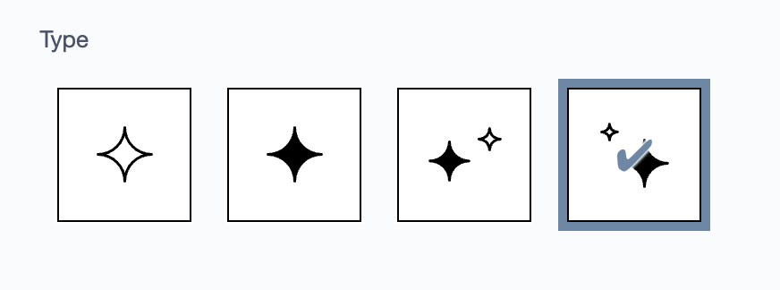
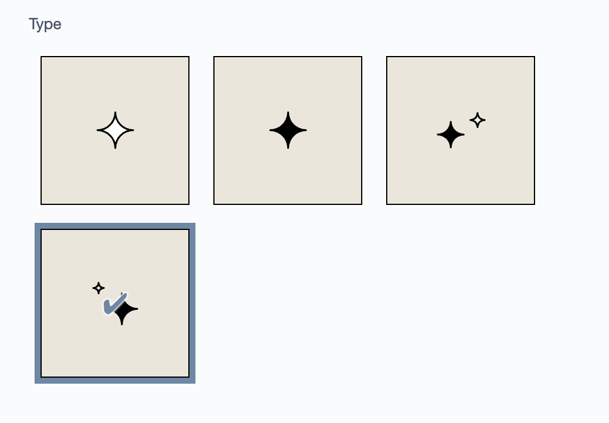
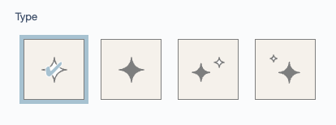

# Silverstripe Visual Fields

[](https://packagist.org/packages/iliain/silverstripe-visualfields)
[](https://packagist.org/packages/iliain/silverstripe-visualfields)
[](https://packagist.org/packages/iliain/silverstripe-visualfields)
[](https://packagist.org/packages/iliain/silverstripe-visualfields)
[](https://packagist.org/packages/iliain/silverstripe-visualfields)

Provides similar functionality to [heyday/silverstripe-colorpalette](https://github.com/WPP-Public/silverstripe-colorpalette), but uses images rather than colours.

## Installation (with composer)

    composer require iliain/silverstripe-visualfields

## Usage

```php
$fields->addFieldToTab('Root.Main', $typeField = VisualOptionField::create('IconType', 'Type', [
    'icon-1' => '/path/to/icon-1.png',
    'icon-2' => '/path/to/icon-2.png',
    'icon-3' => '/path/to/icon-3.png',
    'icon-4' => '/path/to/icon-4.png',
]));
```



## Customising

You can customise the size and background colour of the images with the following options:

```php
$typeField
    ->setOptionWidth('125px')
    ->setOptionHeight('125px')
    ->setOptionBackground('#efe6da') // Only visible if the image has transparency
    ->setBackgroundSize('cover');
```



<br>

You can also use the `setReadonly()` method to make the field read-only, which will disable the radio buttons and prevent the user from changing the value, but allow them to see the stylised options.

```php
$typeField->setReadonly(true);
```


